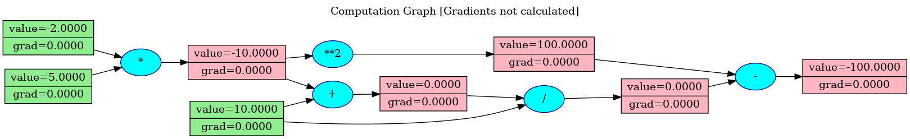
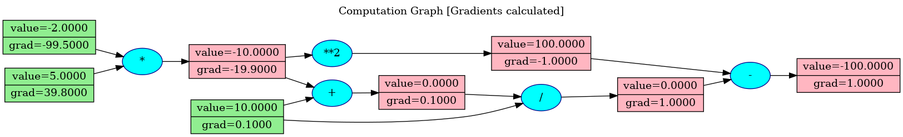

# backprop-computational-graph
This is a simple implementation of backpropagation for calculation of gradients using computational graphs.


## Example

1. Let's create an expression \
$a = -2, b = 5, c = 10$ \
$d = a * b$ \
$e = c + d$ \
$f = e / c$ \
$g = f - d ^ 2$ 

2. Code it up using our Tensor class

```py
from tensor import Tensor

a = Tensor(-2)
b = Tensor(5)
c = Tensor(10)
d = a * b
e = c + d
f = e / c
g = f - d ** 2
```
3. Plot the computational graph

```py
from plot_graph import create_computational_graph

create_computational_graph(g, name='forward', render=True)
```




4. Calculate the gradients

```py
g.backward()
create_computational_graph(g, name='backward', render=True)
```




## References

1. <a href="https://www.youtube.com/watch?v=VMj-3S1tku0">The spelled-out intro to neural networks and backpropagation: building micrograd by Andrej Karpathy </a>

