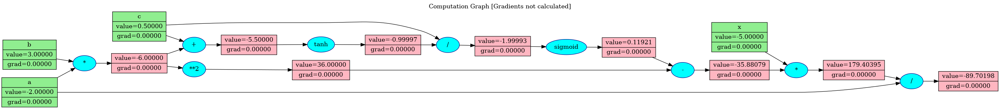

# backprop-computational-graph
This is a simple implementation of backpropagation using computational graphs. 

Computational Graphs are directed acyclic graphs that represent mathematical expressions and facilitate the efficient calculation of gradients. It is used in Deep Learning frameworks such as PyTorch for calculating gradients for backpropagation. 

As of now, this implementation is only for scalar functions (will update it for vector functions too in future).


## How to use

1. Let's create an expression \
$a = -2, b = 3, c = 0.5, x = -5$ \
$d = a * b$ \
$e = Tanh(c + d)$ \
$f = Sigmoid(\frac{e}{c})$ \
$g = (f - d ^ 2) * x$ \
$l = g/a$

2. Code it up using the Tensor class

```py
from tensor import Tensor
from activations import Sigmoid, Tanh

a, b, c, x = Tensor(-2), Tensor(3), Tensor(0.5), Tensor(-5)
d = a * b
e = Tanh()(c + d)
f = Sigmoid()(e / c)
g = (f - d ** 2) * x
l = g/a
```
3. Plot the computational graph

```py
from plot_graph import create_computational_graph

create_computational_graph(g, name='forward', render=True)
```




4. Calculate the gradients

```py
g.backward()
create_computational_graph(g, name='backward', render=True)
```


[Optional] Reset gradients

```py
g.reset_grads()
```


## References

1. <a href="https://www.youtube.com/watch?v=VMj-3S1tku0">The spelled-out intro to neural networks and backpropagation: building micrograd by Andrej Karpathy </a>

